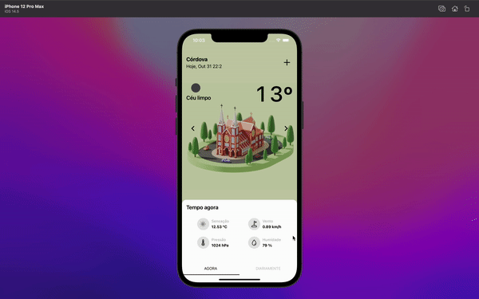

# Weather App

<p align="center">
  
</p>

>🚀 🌧  Weather app in react native using typescript.

## 💻 Prerequisites

* Expo
* NodeJS


## Config

Edit ``constants`` file in ``src/config`` and set this config variables.

```typescript
const OPEN_WEATHER_API_APP_ID = '';
const GOOGLE_PLACES_API_KEY = '';
```


## 🚀 Install

```
yarn install
or
npm install
```

```
expo start
```

## Inspiration

This application is an implementation [Sang Nguyen's](https://dribbble.com/sanggggg) layout available [here](https://dribbble.com/shots/16307033--28-Weather-App-Interaction) 
